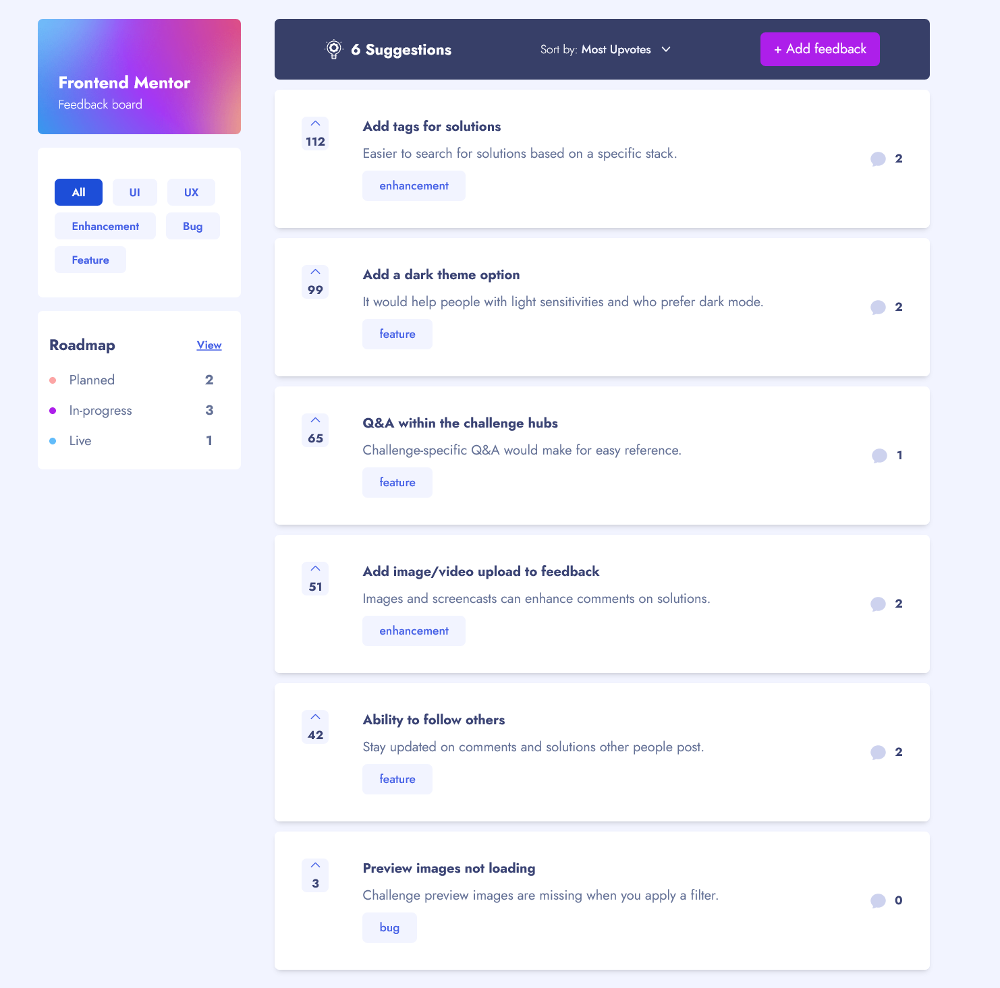

# Product feedback app solution

## Table of contents

-   [Overview](#overview)
    -   [The challenge](#the-challenge)
-   [My process](#my-process)
    -   [Screenshot](#screenshot)
    -   [Built with](#built-with)
    -   [Demo](#demo)
-   [Author](#author)

## Overview

### The challenge

Users can be able to:

-   View the optimal layout for the app depending on their device's screen size
-   See hover states for all interactive elements on the page
-   Create, read, update, and delete product feedback requests
-   Receive form validations when trying to create/edit feedback requests
-   Sort suggestions by most/least upvotes and most/least comments
-   Filter suggestions by category
-   Add comments and replies to a product feedback request
-   Upvote product feedback requests
-   Bonus: Keep track of any changes, even after refreshing the browser

### Screenshot

## My process

### Built with

-   Semantic HTML5 markup
-   CSS custom properties
-   Flexbox
-   CSS Grid
-   Mobile-first workflow
-   [React](https://reactjs.org/) - JS library
-   [Redux](https://redux.js.org/) - React library
-   [Next.js](https://nextjs.org/) - React meta-framework
-   [TailwindCSS](https://styled-components.com/) - For styles

### Demo

- Live Site URL:(https://feedback-web-app.vercel.app/)

## Author

-   Linkedin - [Farhang Alizadeh](https://www.linkedin.com/in/farhang-alizadeh-3bb232235/)
